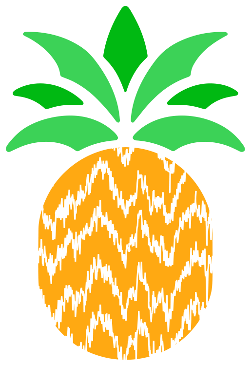
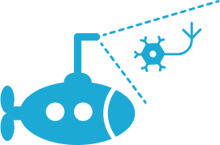

#   Pynapple & NeMoS tutorials

A collection of tutorials showing how to analyse systems-neuroscience datasets with [`NeMoS`](https://nemos.readthedocs.io/en/latest/index.html). Each collection reproduces a well-known course or paper, rebuilt around [`pynapple`](https://pynapple.org/) for data handling and `NeMoS` for modeling — so you can see modern tools applied to familiar material.

## Tutorial collections

### [Data Science & Data Skills for Neuroscientists — J.W. Pillow (SfN 2016)](tutorials/Sfn-2016-tutorial-GLMs/index.md)

A faithful rebuild of Jonathan Pillow's spike-train GLM short course. Starting from retinal ganglion cell recordings, it walks from spike binning and design-matrix construction through the spike-triggered average, linear-Gaussian and Poisson GLMs, a non-parametric nonlinearity, model comparison (log-likelihood and AIC), and simulating spike trains from the fitted model.

```{toctree}
:hidden:
:glob:

tutorials/*/index
```